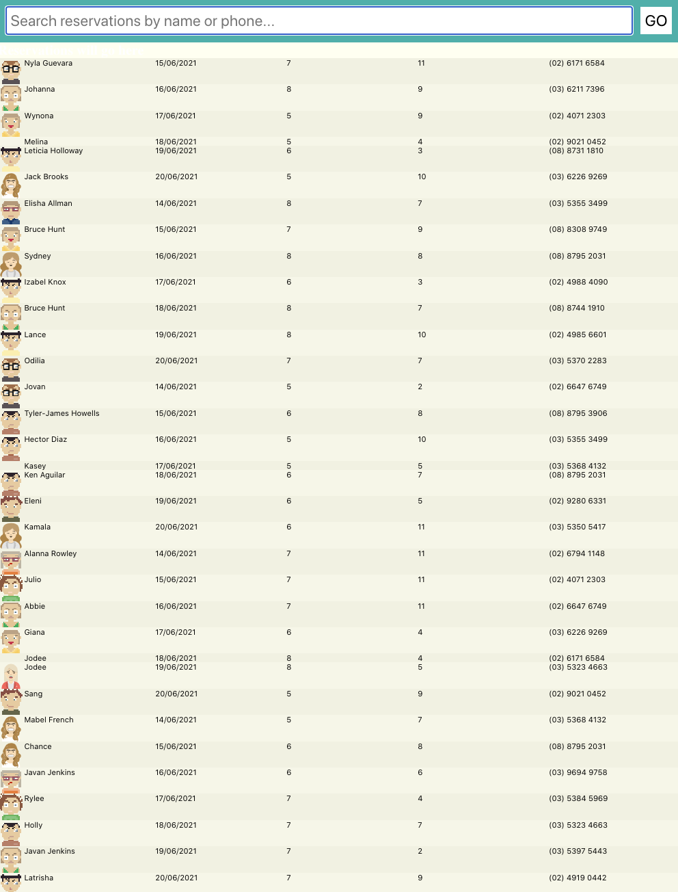

# Reservations

You are to create a React Native App that will allow users to view a list of reservations. 

The app will need to use axios (or a simulated axios call) to get the list of reservations from your API backend.

The project will need to be made using React Native and implement flex layout design to adequately display on any phone dimension.

## Instructions

You need to create an application using the React & React Native framework.

### Task 1

**Create a React Native app with at least 1 screen**

The app, at minimum, requires at least 1 screen to display the list of reservations.

The list of reservations will be an array of objects. The reservation object will be defined by you.

### Task 2

**Implement Axios or Promise**

The app will retrieve the list of reservations from your API using the axios get() function. 

If you do not have an API running you can return a list of reservations using a simulated response.

The simulated response will need to be using the Promise method.

### Task 3

**Create a responsive Layout**


The app needs to be responsive to any width or height. This will be achieved using a flex layout in your screen. 

### Task 4

**Use an Image**

The app needs to display at least 1 image.

This could be the logo or per reservation (if you have images on reservations).

Make sure you have written your name on each page of your submission before attaching the cover sheet and submitting to your teacher/assessor for marking

**All Reservations**




**By Name**


## API endpoint

```
https://localhost:5001/Reservation
```

### Swagger API


### JSON

